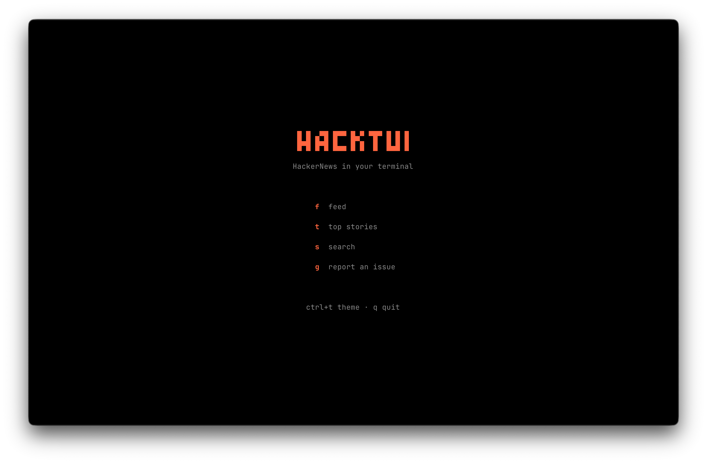

# HackTUI

HackerNews, but in your terminal. No browser tabs, no distractions.

Built with [OpenTUI](https://github.com/opentui/opentui) because clicking around a website to read comments feels like too much work when you're already living in the shell.

## What it looks like



## Install

Requires [Bun](https://bun.sh) (it's an OpenTUI thing).

```bash
bun add -g hacktui
hacktui
```

Or run without installing:

```bash
bunx hacktui
```

## Usage

| Key | Action |
|-----|--------|
| `↑` `↓` | Navigate stories |
| `←` `→` | Previous / next page |
| `Enter` | View story detail |
| `o` | Open story in browser |
| `f` | Go to Feed |
| `t` | Go to Top Stories |
| `s` | Search |
| `Esc` | Back |
| `Ctrl + t` | Toggle dark/light theme |
| `q` | Quit |

Pagination works like the real HN — 30 stories per page, numbered continuously across pages.

## Why

I got tired of context-switching to a browser just to check HN. This stays in the terminal where I already am. Press Enter to read story details and comments inline, or press `o` to open in your browser when you actually want to leave the terminal.

## License

MIT
